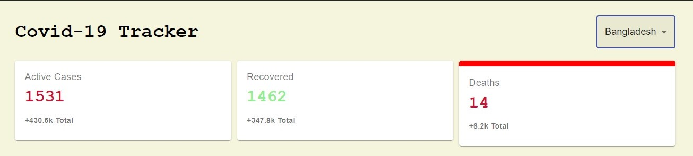
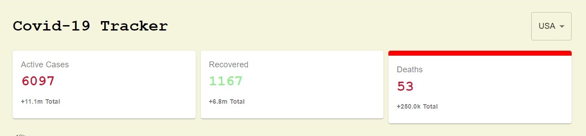
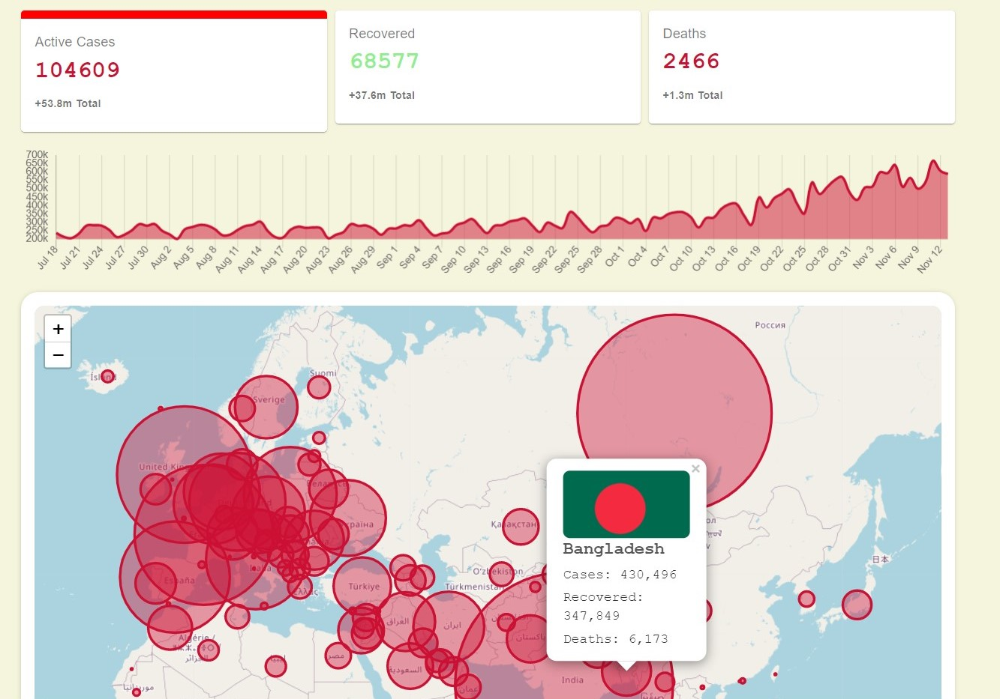
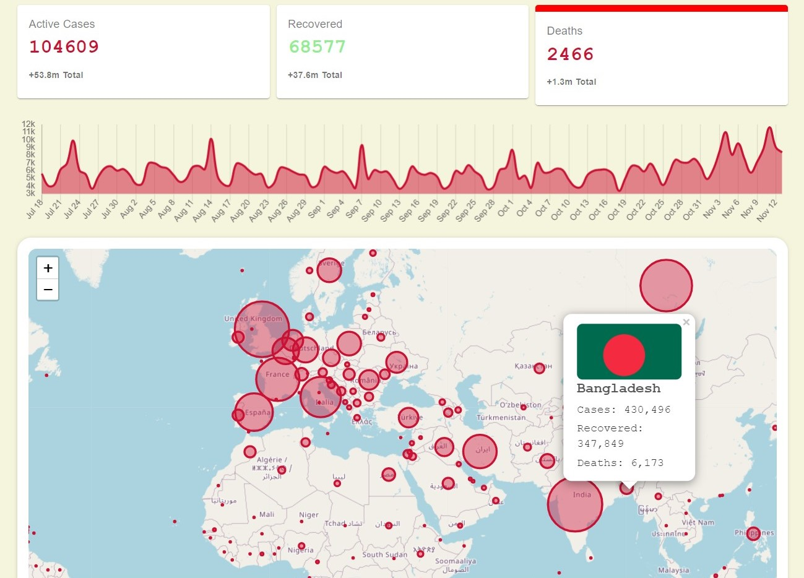
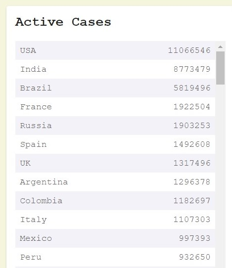
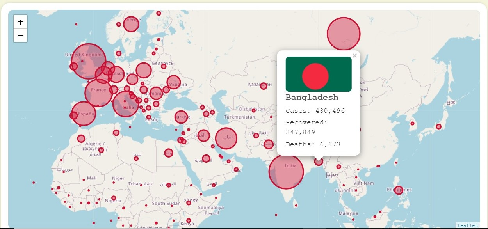

# covid-19 Update
#### This web application is a covid-19 update dash board. Live demo can be found [here](https://ds-joy.github.io/covid-19/). 

## Features:
1. #### Country Picker. 
2. #### Cards showing Daily active cases, recovered and deaths. 
3. #### A Graph showing the change in total active, recovered and death cases during last 20 days.
4. #### A responsive map which visualizes total active, recovered and death cases. 
5. #### A Table showing total No. of covid cases for each country.

 
 

## A Brif Description:
* #### Selecting a country from the dropdown changes the information displayed on the card accordingly.

 

 

* #### We can click and select each card and selecting a card will apply changes to all the components. For example if the 'active cases' card is selected the graph and map will show the 'active cases' data.

 

 

* #### The table on the right hand side is sorted by the total number of cases of each country. 
 

 

* #### In the map a red circle is drown over each country. The learger the number of cases the bigger the circle. 
 

 

* #### When we click a country on the map a pop-up will show up and the pop-up contains total active, recovered and deaths of that specific country.
 

 

* #### The full website is responsive and adjusts it's style across devices

